# LLM-training-project-n8n
My Training project on slides generation and sharing using n8n

# AI-Powered Google Slides Presentation Generator
An intelligent n8n workflow that automatically creates professional Google Slides presentations from natural language prompts using OpenAI GPT-4o-mini.

# 🎯 Overview
This workflow transforms user text input into fully-formatted Google Slides presentations with custom styling, bullet points, and automated content generation. Simply describe what presentation you need, and the AI will generate a complete slide deck with titles, subtitles, and detailed content.

# ✨ Features

- __Natural Language Input__: Describe your presentation topic in plain English
- __AI-Powered Content Generation__: GPT-4o-mini creates structured slide content
- __Automated Slide Creation__: Programmatically builds slides with custom layouts
- __Professional Styling__: Consistent fonts, colors, and formatting
- __Smart File Naming__: AI generates contextual presentation titles
- __Public Sharing__: Automatically sets presentation to "writer" access for anyone
- __Batch Processing__: Efficiently creates multiple slides in sequence

## Workflow Diagram

```mermaid
graph TB
    A[💬 Chat Trigger<br/>User Input] --> B[🤖 GPT-4o-mini<br/>Generate Filename]
    B --> C[📊 Google Slides<br/>Create Presentation]
    C --> D[🔗 Google Drive<br/>Share File]
    D --> E[⚙️ Set Variables<br/>total_slides = 5]
    E --> F[🧠 AI Agent<br/>Generate Content]
    F --> G[📝 Parse JSON<br/>Clean Output]
    G --> H[🔄 Loop Over Items<br/>Split in Batches]
    H --> I[🎨 Format Layout<br/>Prepare Elements]
    I --> J[🔨 HTTP Request<br/>Build Slide]
    J --> K[⏱️ Wait<br/>Brief Pause]
    K --> H
    H --> L[✓ Done<br/>Complete!]
    
    style A fill:#667eea
    style B fill:#f093fb
    style C fill:#4285f4
    style D fill:#4285f4
    style E fill:#fa709a
    style F fill:#f093fb
    style G fill:#48bb78
    style H fill:#ed8936
    style I fill:#9f7aea
    style J fill:#3182ce
    style K fill:#718096
    style L fill:#38a169
```

# 🔄 Workflow Breakdown

__1. Chat Trigger Node__
-	__Type__: @n8n/n8n-nodes-langchain.chatTrigger
-	__Purpose__: Receives user input via chat interface
-	__Configuration__: Allows file uploads (though not utilized in current flow)
  
  
  
__2. File Name Generation__
-	__Type__: @n8n/n8n-nodes-langchain.openAi
-	__Model__: GPT-4o-mini
-	__Purpose__: Creates contextual file names based on user input
-	__Example__: Input "how to install wordpress" → Output "Presentation_2025-10-31_How to Install Wordpress"
-	__System Prompt__: Acts as a file name generator with specific formatting rules
  
__3. Create Presentation__
-	__Type__: n8n-nodes-base.googleSlides
-	__Purpose__: Creates empty Google Slides presentation
-	__Output__: Returns presentationId for subsequent operations

 
  
__4. Share File__
-	__Type__: n8n-nodes-base.googleDrive
-	__Purpose__: Sets presentation permissions
-	__Configuration__: 
1.	__Role__: Writer
2.	__Type__: Anyone (public access)

   
   
__5. Edit Fields (Configuration)__
-	__Type__: n8n-nodes-base.set
-	__Purpose__: Sets workflow parameters
-	__Configuration__: total_slides: 5
  
__6. AI Agent (Content Generation)__
-	__Type__: @n8n/n8n-nodes-langchain.agent
-	__Model__: GPT-4o-mini
-	__Purpose__: Generates structured slide content
-	__Output Format__:
json
[
  {
    "title": "Slide Title",
    "subtitle": "Slide Subtitle",
    "bullets": ["Point 1", "Point 2", "Point 3", "Point 4", "Point 5"]
  }
]
-	__Requirements__: 5 detailed bullet points per slide

  
  
__7. Parse JSON__
-	__Type__: n8n-nodes-base.code
-	__Purpose__: Extracts and validates JSON from AI output
-	__Features__: 
1.	Strips markdown code fences
2.	Handles malformed output
3.  Extracts JSON arrays
4.	Returns one item per slide
   
__8. Loop Over Items__
-	__Type__: n8n-nodes-base.splitInBatches
-	__Purpose__: Processes slides sequentially
-	__Batch Size__: Dynamic (based on total_slides parameter)
  
__9. Slides Layout__
-	__Type__: n8n-nodes-base.set
-	__Purpose__: Prepares slide element data
-	__Configuration__: 
1.	Logo text: "@nikhil"
2.	Unique IDs for each element per slide
3.	Text formatting for bullets
   
__10. HTTP Request (Batch Update)__
-	__Type__: n8n-nodes-base.httpRequest
-	__API__: Google Slides API v1 batchUpdate
-	__Purpose__: Creates and formats slide elements
-	__Operations Per Slide__: 
1.	Create blank slide
2.	Add logo text box
3.	Add title text box
4.	Add subtitle text box
5.	Add bullet points text box
6.	Apply formatting and styling

   
   
__11. Wait Node__
-	__Type__: n8n-nodes-base.wait
-	__Purpose__: Prevents API rate limiting between slide creations
  

# 🔧 Technical Details
__APIs Used__
-	__OpenAI API__: GPT-4o-mini for text generation
-	__Google Slides API v1__: Presentation creation and manipulation
-	__Google Drive API v3__: File sharing and permissions
  
__Node Types__
-	__Chat Trigger__: 1
-	__AI/LLM Nodes__: 3 (OpenAI node + AI Agent + Chat Model)
-	__Google Service Nodes__: 3 (Slides + Drive)
-	__Utility Nodes__: 4 (Set, Code, Split, Wait)
-	__HTTP Request__: 1
  
__Authentication Required__

__1.	OpenAI API Key__
-	__Credential ID__: LdXvQduVbrO3GpRs
- __Required for__: File naming & content generation
  
__2.	Google Slides OAuth2___
-	__Credential ID__: 5cKZbs8ywg9gkftP
-	__Scopes__: Create and edit presentations

__4.	Google Drive OAuth2__
-	__Credential ID__: SgnsL9trNU1afVfx
-	__Scopes__: File sharing and permissions
  
# 🚀 Setup Instructions

__Prerequisites__
-	n8n instance (self-hosted or cloud)
-	OpenAI API account with credits
-	Google Cloud Project with APIs enabled: 
-	Google Slides API
-	Google Drive API
-	OAuth2 credentials for Google services
  
__Installation Steps__

__1.	Import Workflow__
bash
- Import the slides_ppt_n8n.json file into your n8n instance
   
__2.	Configure OpenAI Credentials__
-	Navigate to Credentials
-	Add OpenAI API credentials
-	Enter API key
  
__3.	Configure Google OAuth2__
-	Create OAuth2 credentials in Google Cloud Console
-	Add credentials to n8n: 
	Google Slides OAuth2 API
	Google Drive OAuth2 API
-	Authorize scopes

__4.	Activate Workflow__
-	Set workflow to "Active"
-	Note the webhook URL from Chat Trigger
  
__5.	Test Workflow__
-	Send a test message: "Create a presentation about machine learning basics"
-	Verify presentation is created in Google Drive
  
__💡 Usage Examples__

__Example 1__: Technical Tutorial

Input: "Create a presentation on Docker containerization"

Output: 5-slide presentation with:
-	Introduction to Docker
-	Container Architecture
-	Docker Commands
-	Use Cases
-	Best Practices
  
__Example 2__: Business Presentation

Input: "Make slides about Q4 2024 sales strategy"

Output: 5-slide presentation with:
-	Executive Summary
-	Market Analysis
-	Strategic Initiatives
-	Timeline & Milestones
-	Success Metrics
  
__Example 3__: Educational Content

Input: "Presentation about photosynthesis for high school"

Output: 5-slide presentation with:
-	What is Photosynthesis?
-	Light Reactions
-	Calvin Cycle
-	Importance
-	Real-world Applications
  
__⚙️ Configuration Options__
- Adjustable Parameters
- Number of Slides
  
javascript
// In "Edit Fields" node
{
  "total_slides": 5  // Change to desired number
}
- Logo Text
  
javascript
// In "slides layout" node
{
  "logo_str": "@nikhil"  // Replace with your brand
}
- Slide Content Requirements
  
- javascript
// In "AI Agent" node prompt
"at least 5 detailed bullet points"  // Adjust quantity

# 🔍 Troubleshooting
__Common Issues__

__1. JSON Parsing Errors__
-	Cause: AI output includes prose or malformed JSON
-	Solution: The parse JSON node handles this automatically by extracting content between [ and ]

__3. API Rate Limiting__
-	Cause: Too many rapid API calls
-	Solution: Wait node is included; adjust timing if needed

__5. Authentication Failures__
-	Cause: Expired OAuth tokens
-	Solution: Reconnect Google credentials in n8n

__7. Incomplete Slides__
-	Cause: AI generated fewer slides than expected
-	Solution: Check AI Agent prompt and adjust requirements

__📈 Performance Considerations__
-	Average Execution Time: 30-60 seconds for 5 slides
-	API Calls: ~12 calls per slide (includes formatting)
-	Cost Estimation: 
1.	OpenAI GPT-4o-mini: ~$0.01 per presentation
2.  Google APIs: Free (within quotas)

__🛡️ Security Notes__
-	Presentations are created with public writer access
-	Consider adding authentication for production use
-	Store API keys securely using n8n credentials manager
-	Review Google Cloud Project permissions regularly

__🔮 Future Enhancements__
-	Support for image insertion
-	Custom theme selection
-	Chart and graph generation
-	Multiple layout templates
-	PDF export option
-	Email delivery of completed presentations
-	Support for different slide counts per request
-	Custom color schemes
-	Integration with company branding guidelines

__📝 License__
This workflow is provided as-is for educational and commercial use.

__🤝 Contributing__
Contributions are welcome! Please:
1.	Fork the repository
2.	Create a feature branch
3.	Submit a pull request with detailed description

  
